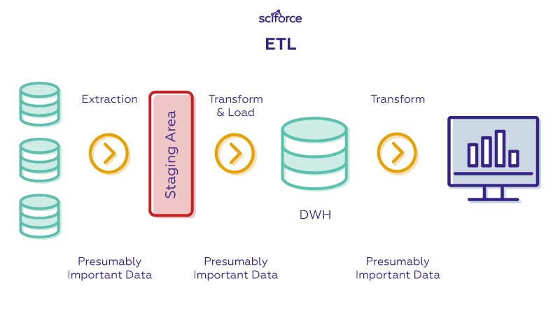

## Local Data ETL

### Instructions

* Create a `customer_db` database in pgAdmin 4 then create the following two tables within:

  * A `premise` table that contains the columns `id`, `premise_name` and `county_id`.

  * A `county` table that contains the columns `id`, `county_name`, `license_count` and `county_id`.

  * Be sure to assign a primary key, as Pandas will not be able to do so.

* In Jupyter Notebook perform all ETL.

* **Extraction**

  * Put each CSV into a pandas DataFrame.

* **Transform**

  * Copy only the columns needed into a new DataFrame.

  * Rename columns to fit the tables created in the database.

  * Handle any duplicates. **HINT:** some locations have the same name but each license number is unique.

  * Set index to the previously created primary key.

* **Load**

  * Create a connection to database.

  * Check for a successful connection to the database and confirm that the tables have been created.

  * Append DataFrames to tables. Be sure to use the index set earlier.

* Confirm successful **Load** by querying database.

* Join the two tables and select the `id` and `premise_name` from the `premise` table and `county_name` from the `county` table.
